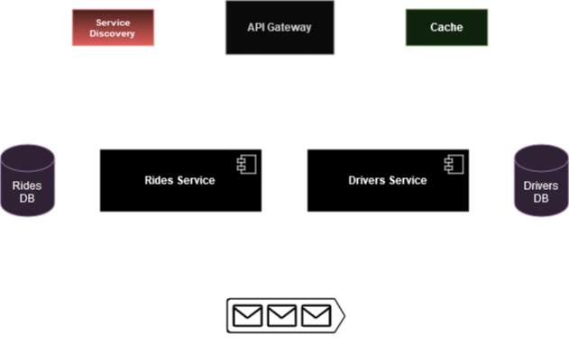

# Ride-Sharing Platform (Uber clone)

## Application Suitability:

Implementation through distributed systems of a Ride-Sharing Platform is necessary, because by adopting a monolithic approach there is a possibility to ran into several operational issues that microservices solve :

1. **Availability Risks**. A single regression within a monolithic code base can bring the whole system down.
2. **Risky, expensive deployments**. These are painful and time consuming to perform with the frequent need for rollbacks.
3. **Poor separation of concerns**. It is difficult to maintain good separations of concerns with a huge code base. 

So, a microservices approach allows the system to become more flexible :

1. **System reliability**. Overall system reliability goes up in a microservice architecture. A single service can go down (and be rolled back) without taking down the whole system.
2. **Separation of concerns**. Architecturally, microservice architectures force you to ask the question “why does this service exist?” more clearly defining the roles of different components.
3. **Autonomous execution**. Independent deployments unlock better continous integration and safer deployments.

For example, Uber began its journey with a monolithic architecture built for a single offering in a single city. Having one codebase seemed cleaned at that time, and solved Uber core business problems. However, as Uber started expanding worldwide they rigorously faced various problems with respect to the scalability and continuous integration.

While Uber started expanding worldwide this kind of framework introduced various challenges. The following are some of the prominent challenges :
- All the features had to be re-built, deployed and tested again and again to update a single feature.
- Fixing bugs became extremely difficult in a single repository as developers had to change the code again and again.
- Scaling the features simultaneously with the introduction of new features worldwide was quite tough to be handled together.

To avoid such problems Uber decided to break its monolithic architecture into multiple codebases to form a microservice architecture.

## Service Boundaries



- **Ride Request Service**
    - Accepting and processing ride requests from passengers.
    - Matching available drivers to ride requests based on availability.
    - Managing tracking and status updates for rides until they are assigned to a driver.
- **Drivers Service**
    - Handling driver availability (online/offline status).
    - Assigning ride requests to available drivers.
    - Real-time tracking of driver locations for passenger updates.

## Technology Stack and Communication Patterns

All services will be written in Java using Spring Framework, while the Gateway and Service Discovery will be written in Python using FastAPI. Rides Service and Drivers Service will communicate between themselves by message broker communication pattern. ActiveMQ serves as the communication middleware between the Rides Service and the Drivers Service. Services will also make RESTful HTTP requests to endpoints provided by the Service Discovery.

## Data Management

Each service will have its own Postgres database. Ride Request Service will store information about ride requests made by passengers. Drivers Service will store driver-specific information. 

Request Ride Service:

1. Ride Assignment Topic:
    This topic is used to notify available drivers about newly requested rides.
    Messages sent to this topic might include ride details like passenger ID, pickup location, drop-off location, and ride ID.

2. Ride Cancellation Topic:
    When a ride is canceled, a message is sent to this topic to inform any assigned drivers that the ride has been canceled.
    Messages may include ride ID and cancellation reason.

- Request a Ride :
    - Endpoint: `/api/rides/request`
    - Method: POST
    - Request Data: 
        ```json
        {
            "passengerId": "12345",
            "pickupLocation": {
                "latitude": 37.7749,
                "longitude": -122.4194
            },
            "dropOffLocation": {
                "latitude": 37.7899,
                "longitude": -122.4057
            }
        }
        ```
    - Response:
        ```json
        {
            "rideId": "abc123",
            "status": "pending",
        }
        ```

- Get Ride Info :
    - Endpoint: `/api/rides/{ride_id}`
    - Method: GET
    - Response:
        ```json
        {
            "rideId": "abc123",
            "passengerId": "12345",
                        "pickupLocation": {
                "latitude": 37.7749,
                "longitude": -122.4194
            },
            "dropOffLocation": {
                "latitude": 37.7899,
                "longitude": -122.4057
            },
            "status": "pending"
        }
        ```

- Cancel a Ride :
    - Endpoint: `/api/rides/cancel`
    - Method: POST
    - Request Data: 
        ```json
        {
            "rideId": "abc123",
            "passengerId": "12345",
            "reason": "Traffic delay"
        }
        ```
    - Response:
        ```json
        {
            "rideId": "abc123",
            "status": "canceled"
        }
        ```

Drivers Service:

1. Ride Acceptance Topic:
    After a driver receives a ride assignment, the notification is sent to this topic.
    Messages include ride details like passenger ID, pickup location, drop-off location, and ride ID.

2. Ride Completion Topic:
    After a ride is completed, an event can be published to this topic by the Driver Service.

- Change Availability Status :
    - Endpoint: `/api/drivers/availability`
    - Method: PUT
    - Request Data: 
        ```json
        {
            "driverId": "xyz789",
            "availabilityStatus": "online"
        }
        ```
    - Response:
        ```json
        {
            "driverId": "xyz789",
            "availabilityStatus": "online"
        }
        ```

- Complete a Ride :
    - Endpoint: `/api/drivers/complete-ride`
    - Method: POST
    - Request Data: 
        ```json
        {
            "driverId": "xyz789",
            "rideId": "abc123"
        }
        ```
    - Response:
        ```json
        {
            "rideId": "abc123",
            "status": "completed"
        }
        ```

## Deployment and Scaling

Each microservice will be containerized within Docker containers. This approach allows to package the microservices and their dependencies into lightweight, isolated containers, also ensure consistency across different environments and simplifying the deployment process. For a simple Uber clone, using Docker Compose for orchestration may be sufficient. However, I will consider Kubernetes for its advanced scaling and production-grade features if its needed along the project.